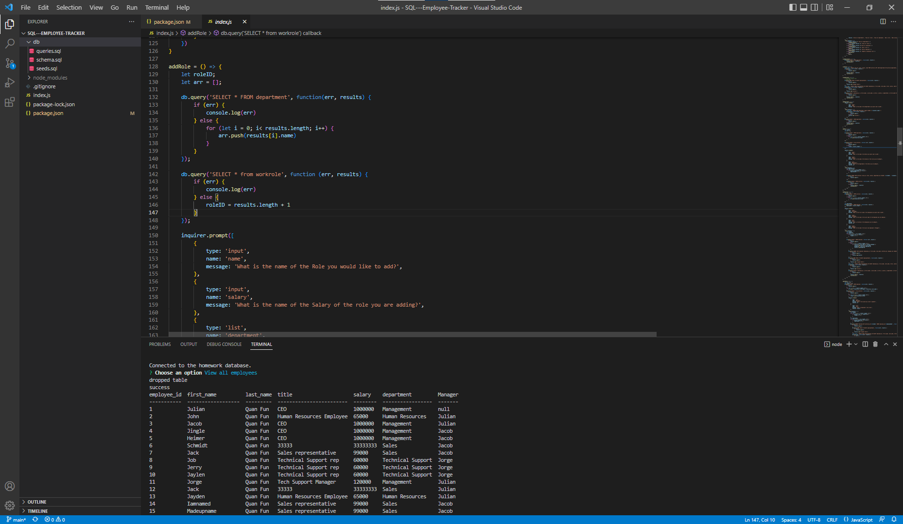

# Employee Tracker 

## Description

### What does Employee Tracker do?

This project uses SQL and the console.table package to store information on company employees, departments, etc. and then display the information in the terminal.


### Successes and Failures

This project completes all original goals.

## Table of Contents

- [Installation](#installation)
- [Usage](#usage)
- [Credits](#credits)
- [Contribution](#contribution)
- [Questions](#questions)
- [Licence](#licence)

---

## Installation 

### Technologies Used in Development

Technologies used include:

SQL, console.table npm package, as well as dotenv. package.

### Installation Instructions

```md
Make sure SQL is installed on your machine. Run npm install in the root of the project to install the required packages.
```

## Usage



```md
Connect to the SQL server on your machine in the root of the project and type source ./db/schema.sql; (afterwards you can do ./db/seeds.sql; for dummy data). Afterwards create a .env file and add "DB_PASSWORD = <yourpasswordhere>" (without the quotes). Lastly type npm run start in the root of the project to begin.
```

## Credits

All code was written by me.

## Contribution

Guidelines for contribution:

No contribution necessary.

## Questions

No contact.

https://github.com/jq67


---
## Licence
This project is covered under the `Mit License`